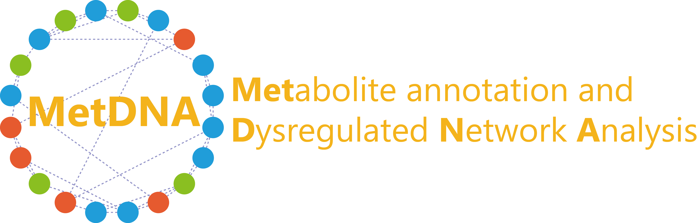

---
output:
  html_document: default
  pdf_document: default
  word_document: default
---

```{r setup, include=FALSE}
knitr::opts_chunk$set(echo = TRUE)
```

<center></center>

<h1>**Analysis report**</h1>
<h3>Xiaotao Shen, Zhengjiang Zhu</h3>
<h3>`r format(Sys.Date())`</h3>

---

### **(1) INTRODUCTION**

#### MetDNA (version 0.99.07) is used for metabolite annotation and dysregulated network analysis of untargeted metabolomics.

---

### **(2) PARAMETERS**

#### **Table 1: The parameter setting of this analysis**

```{r, echo=FALSE, message=FALSE, warning=FALSE, message=FALSE}
library(knitr)
load("parameter")
colnames(parameter) <- c("Patameter", "Value", "Meaning")
kable(parameter, format = "markdown")
```

---

### **(3) SAMPLE INFORMATION**


---

### **(4) METABOLITE ANNOTATION**

#### The metabolite annotation is based on metabolic reaction network. 


#### Confidence level (from grade 1 to grad 4) is assigned to each metabolie.

 


---

### **(5) DYSREGULATED NETWORK ANALYSIS**


                                              

#### **Table 2: The information of dysregualted networks.** The detailed information can be got from *dysregulated.network.MSEA.csv* in */Dysregulated_network_analysis_result_POS/pathway_information*.                 

```{r, echo=FALSE, message=FALSE, warning=FALSE, message=FALSE}
library(knitr)
load("pathway.result")
# temp.idx <- which(dn.result$q.value < 0.05)
# if(length(temp.idx) == 0 & nrow(module.result) > 5){
#   temp.idx <- 1:5
# }else{
#   temp.idx <- temp.idx
# }

name <- pathway.result$pathway.name
pathway.result$Overlap <- pathway.result$Overlap*100/pathway.result$Pathway.length
rownames(pathway.result) <- NULL
pathway.result <-pathway.result[,c(1,2,6,7,8,9,11)]
colnames(pathway.result) <- c("Pathway name", "Pathway ID", "Pathway size",
                              "Overlap (%)", "P value (adjusted by P value)",
                              "P value (adjusted by overlap)", "Detected metabolite")
kable(pathway.result)
```


#### Dysregulated peaks (according to pvalues) are used to identify dysregulated modules. The dysregulated modules with p values less than 0.05 are combined as dysregulated network. Metabolite set analysis (MSEA) is used to annotate functions of each module. The MSEA result for each module can be found in */Dysregulated_network_analysis_result_POS/module_information/Module_MSE analysis*.

 

#### **Table 3: The information of dysregualted modules.** The detailed information can be got from *module.result.csv* in */Dysregulated_network_analysis_result_POS/module_information*

```{r, echo=FALSE, message=FALSE, warning=FALSE, message=FALSE}
library(knitr)
load("module.result")
# temp.idx <- which(module.result$p.value < 0.05)
# if(length(temp.idx) == 0 & nrow(module.result) > 5){
#   temp.idx <- 1:5
# }else{
#   temp.idx <- temp.idx
# }

overlap <- as.numeric(module.result$`Detected metabolite number`)*100/as.numeric(module.result$`Module size`)
module.result$`Detected metabolite number` <- overlap
colnames(module.result)[5] <- "Overlap (%)"
kable(module.result[,c(1,2,3,4,5,13)])
```


