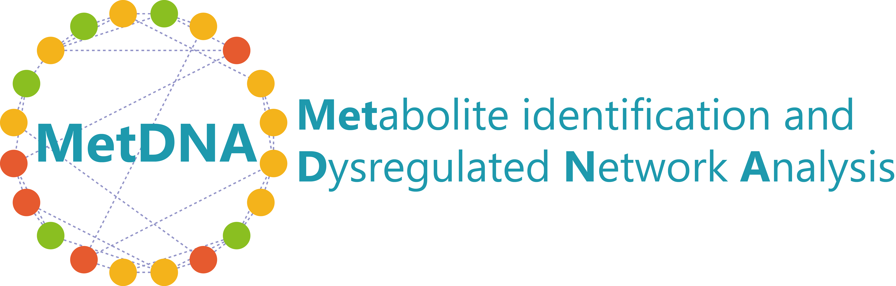

---
output:
  html_document: default
  pdf_document: default
  word_document: default
---

```{r setup, include=FALSE}
knitr::opts_chunk$set(echo = TRUE)
```

<center></center>

<h1>**Analysis report**</h1>
<h3>Laboratory for Mass Spectrometry and Metabolomics ([ZHU LAB](http://www.zhulab.cn/))</h3>
<h3>IRCBC, Chinese Academy of Sciences, Shanghai, China.</h3>
<h3>`r format(Sys.Date())`</h3>

---

### **<font color = "lightseagreen">INTRODUCTION</font>**

<h4> <p style="line-height:1.5em;">**MetDNA (version 1.1)**: Created in 2018 by Xiaotao Shen, Xin Xiong and Ruohong Wang from Dr. Zheng-Jiang Zhu lab, Chinese Academy of Sciences.</p> </h4>

---

### **<font color = "lightseagreen">PARAMETERS</font>**

#### **Table 1: Parameter setting**

```{r, echo=FALSE, message=FALSE, warning=FALSE, message=FALSE}
library(knitr)
load("parameter")
kable(parameter, format = "markdown")
```

---

### **<font color = "lightseagreen">SAMPLE INFORMATION</font>**


<center></center>

#### **Figure 1: Peak intensity profile for positive mode (left panel) and negative mode (right panel).**

---

### **<font color = "lightseagreen">METABOLITE IDENTIFICATION</font>**


<center></center>

#### **Figure 2: The number of identified metabolites (left panel) and peak and metabolite redundancy (right panel). (Positive mode)**


<center></center>

#### **Figure 3: The number of identified metabolites (left panel) and peak and metabolite redundancy (right panel). (Negative mode)**


<center></center>

#### **Figure 4: The confidence levles of identified metabolites. (Positive mode)**


<center></center>

#### **Figure 5: The confidence levles of identified metabolites. (Negative mode)**


---

### **<font color = "lightseagreen">PATHWAY ENRICHMENT ANALYSIS</font>** 


<center></center>

#### **Figure 6: Volcano plot (left panel) and summary of enriched pathways (right panel).**


#### **Table 2: The detailed information of enriched pathways.** 

```{r, echo=FALSE, message=FALSE, warning=FALSE, message=FALSE}
library(knitr)
if(any(dir() == "msea")){
load("msea")  
msea.result <- msea@msea
pathway.name.id <- rownames(msea.result)
pathway.name <- unlist(lapply(strsplit(pathway.name.id, split = ";"), function(x) x[1]))
pathway.id <- unlist(lapply(strsplit(pathway.name.id, split = ";"), function(x) x[2]))
pathway.id <- paste("[", pathway.id, "]", "(http://www.kegg.jp/kegg-bin/show_pathway?", pathway.id, ")", sep = "")
msea.result$Overlap <- msea.result$Overlap*100/msea.result$Pathway.length
rownames(msea.result) <- NULL
msea.result <- msea.result[,-2]
msea.result <- data.frame(pathway.name, pathway.id, msea.result, stringsAsFactors = FALSE)

colnames(msea.result) <- c("Pathway name", "Pathway ID", "P value",
                              "P value (FDR adjust)", "Pathway size", "Overlap (%)")

temp.idx <- which(msea.result[,3] < 0.05)
if(length(temp.idx) > 0){
  msea.result <- msea.result[temp.idx,]
}
kable(msea.result)
}
```

